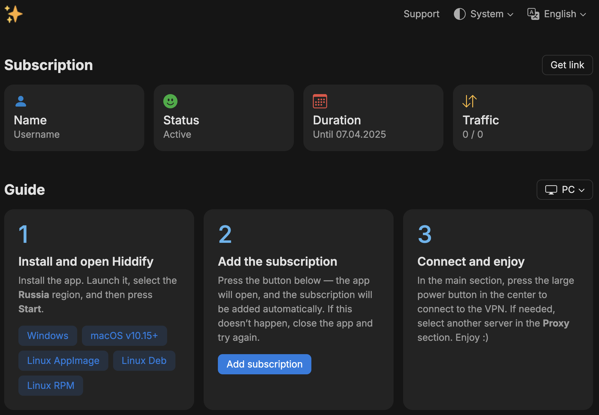

### 📖 V2Ray Json Subscription Proxy with User-Agent Routing

This application serves as a **proxy** for generating and serving **V2Ray subscription configurations** based on `User-Agent`. It dynamically provides the correct configuration format depending on the client version, ensuring seamless compatibility across different applications.

Work with https://remna.st

🇷🇺 [Happ Routing](https://github.com/hydraponique/roscomvpn-happ-routing/tree/main)
---

## ✨ Features
- **🔀 User-Agent-Based Routing**
   - Automatically detects and serves the correct subscription format for supported clients:
      - **v2rayN** (`>=6.40` JSON, older versions Base64)
      - **v2rayNG** (`>=1.8.29` JSON, older versions Base64)
      - **Streisand** (JSON)
      - **Happ** (JSON & Share link)
      - **V2Box** (JSON)
      - **Npv Tunnel** (JSON)
- **🛠 Mux support**
   - Supported `mux` template.
- **Web page template**
  - Supported web page template.
- **🌍 Direct Proxy Fallback**
   - If `User-Agent` is unsupported or the request doesn’t match `/v2ray-json`, the server provides a **default proxy response**.

---
## Base web page

---
## ⚙️ Configuration
Modify `.env.sample` to adjust the application settings:
```
REMNAWAVE_URL=sub_domain
APP_PORT=4000
# V2RAY_TEMPLATE_PATH=/app/templates/v2ray/default.json
# V2RAY_MUX_ENABLED=true
# V2RAY_MUX_TEMPLATE_PATH=/app/templates/v2ray/mux_default.json
# WEB_PAGE_TEMPLATE_PATH=/app/templates/subscription/index.html
```

After modifying execute this
```bash
mv .env.sample .env
```

---

# How to Run

1. Clone the repo
```bash
git clone https://github.com/Jolymmiles/remnawave-json
```

2. Go to the cloned repo
```bash
cd remnawave-json
```
3. Configure .env

4. Run Docker Compose
```bash
docker compose up -d
```
---

# How to update

1. Go to directory with docker-compose.yaml
```bash
remnawave-json
```
2. Update image
```bash
docker compose pull 
```

3. Restart container
```bash
docker compose down --remove-orphans && docker compose up -d 
```

---

## 🌿 **Environment Variables**

1. **REMNAWAVE_URL**  
   _Description:_ The base URL for the subdomain. [Installation Environment Variables](https://remna.st/installation/env#subscription-public-domain)  
   _Example:_ `REMNAWAVE_URL=domain`

2. **APP_PORT**  
   _Description:_ The port on which the application will run.  
   _Example:_ `APP_PORT=4000`

3. **V2RAY_TEMPLATE_PATH**  
   _Description:_ The file path to the default V2Ray configuration template.  
   _Example:_ `V2RAY_TEMPLATE_PATH=/app/templates/v2ray/default.json`

4. **V2RAY_MUX_ENABLED**  
   _Description:_ A flag to enable or disable the V2Ray Mux feature. Set to `true` to enable Mux.  
   _Example:_ `V2RAY_MUX_ENABLED=true`

5. **V2RAY_MUX_TEMPLATE_PATH**  
   _Description:_ The file path to the V2Ray Mux configuration template.  
   _Example:_ `V2RAY_MUX_TEMPLATE_PATH=/app/templates/v2ray/mux_default.json`

6. **WEB_PAGE_TEMPLATE_PATH**  
   _Description:_ The file path to the subscription template.  
   _Example:_ `WEB_PAGE_TEMPLATE_PATH=/app/templates/subscription/index.html`

7. **HAPP_JSON_ENABLED**  
   _Description:_ A flag to enable or disable JSON output for Happ.  
   _Example:_ `HAPP_JSON_ENABLED=false`

8. **HAPP_ROUTING**  
   _Description:_ The routing path for Happ connections.  
   _Example:_ `HAPP_ROUTING=happ://routing/...`

---

## Nginx example
```nginx configuration
server
{
        listen 443 ssl;
        listen [::]:443 ssl;
        http2 on;

        #from .env remnawave SUB_PUBLIC_DOMAIN
        server_name sub_domain ;


        # you certs
        ssl_certificate /root/.acme.sh/example.com_ecc/example.com.cer;
        ssl_certificate_key /root/.acme.sh/example.com_ecc/example.com.key;
        ssl_dhparam /etc/nginx/ssl/dhparams.pem;

        ssl_protocols TLSv1.3;
        ssl_ciphers TLS13-CHACHA20-POLY1305-SHA256:TLS13-AES-256-GCM-SHA384:TLS13-AES-128-GCM-SHA256:EECDH+CHACHA20:EECDH+AESGCM:EECDH+AES;
        ssl_prefer_server_ciphers on;

        # HSTS
        add_header Strict-Transport-Security "max-age=63072000" always;

        # OCSP stapling
        ssl_stapling on;
        ssl_stapling_verify on;
        ssl_trusted_certificate /root/.acme.sh/example.com_ecc/ca.cer;

        location / {
        proxy_http_version 1.1;
        # APP_PORT
        proxy_pass http://127.0.0.1:4000;
        proxy_set_header Host $host;
        proxy_set_header Upgrade $http_upgrade;
        proxy_set_header Connection $connection_upgrade;
        proxy_set_header X-Real-IP $remote_addr;
        proxy_set_header X-Forwarded-For $proxy_add_x_forwarded_for;
        proxy_set_header X-Forwarded-Proto $scheme;
        proxy_set_header X-Forwarded-Host $host;
        proxy_set_header X-Forwarded-Port $server_port;

        proxy_send_timeout 60s;
        proxy_read_timeout 60s;
    }
 }
```


## 📜 License
This project is open-source and available under the **MIT License**.

🚀 *Enhance your V2Ray subscription management with automated User-Agent routing!*

